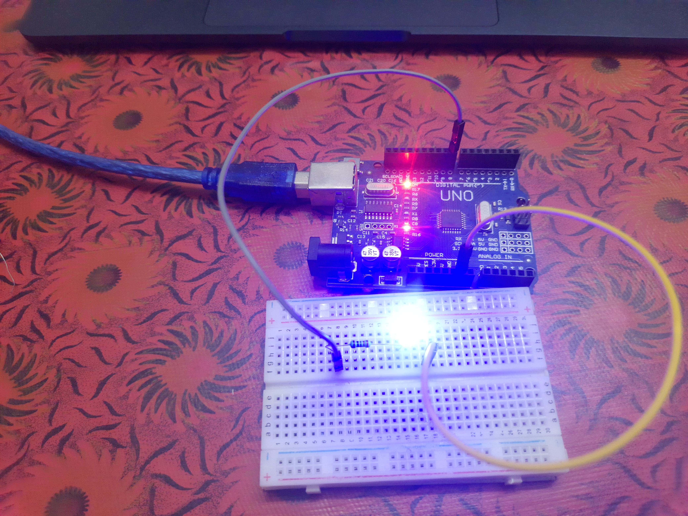

# 💡 LED Blinking Project

## 📝 Overview
This project demonstrates how to blink an LED on and off using an Arduino UNO. It is a beginner-friendly project to get started with Arduino programming, basic electronics, and controlling outputs with the Arduino IDE.

---

## 🧰 Components Used
- **Arduino UNO**
- **Blue LED**
- **100 Ohm Resistor**
- **Breadboard**
- **Jumper Wires**

---

## 🖼️ Image

---

### ⚙️ Wiring:
- Connect the **longer leg (anode)** of the LED to **pin 8** on the Arduino.
- Connect the **shorter leg (cathode)** of the LED to one side of the **100 Ohm resistor**.
- Connect the other side of the resistor to **GND** on the Arduino.

---

## 🧑‍🔧 How It Works
The LED is connected to pin 8 on the Arduino UNO. The Arduino will turn the LED on for 500 milliseconds and off for 500 milliseconds, creating a blinking effect.

---

## 🎥 Video Demonstration
Watch the demonstration of the LED Blinking project on my [Google Drive video](https://drive.google.com/file/d/1OhDoZJxljZffpzRUT4lJ3hJSkuDAP9Ed/view?usp=sharing).
